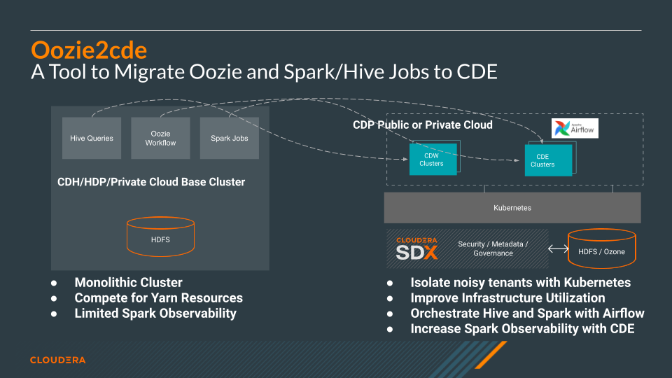

# Migrating Oozie to CDE with the oozie2cde API

## Project Summary

This tutorial demonstrates how you can leverage the oozie2cde API to programmatically translate and transfer your Oozie Workflows to your CDE Cluster.

The API is made of three modules and can help in your migration in three main areas:

1. Parse Oozie Workflows along with related files such as hive and oozie properties.
2. Convert Oozie Workflows into CDE API Payloads. 
3. Perform CDE API actions such as uploading files, creating jobs, etc. with Python Requests in order to execute the migration.

#### Supported Oozie Workflows

In its current version the tool supports four types of Oozie Actions and Airflow Operators:

* Spark -> CDEJobRunOperator
* Hive -> CDWJobRunOperator
* Email -> EmailOperator
* Shell -> BashOperator

#### Recommended Use

The notebook demonstrates an end to end example. It goes through the following motions:

1. Parsing a Hive Oozie Workflow with a properties file and three hive sql jobs
2. Parsing a Spark Oozie Workflow
3. Composing an Airflow DAG from the Spark Oozie Workflow
4. Creating a CDE Resource and uploading the Spark and Airflow DAG files to it
5. Creating corresponding Spark and Airflow CDE Jobs using the same CDE Resource files

_**It's important that you remember the following as you go along**_

* Once the Airflow DAG is complete, make sure you add the code to [declare individual task dependencies](https://airflow.apache.org/docs/apache-airflow/stable/concepts/dags.html#task-dependencies) at the bottom of the file. 
* Check all CDW Query syntax in the Airflow DAG file. The included parser methods may not always reformat the SQL syntax perfectly.
* Each Oozie Workflow and all related files should be located in an individual folder in order to parse them correctly with the Oozie Workflow module.

#### Prerequisites

This project requires access to a CDE Virtual Cluster and the Oozie Workflow files (workflow.xml and optionally any other files such as properties and hive sql). 
The CDE VC could be either in CDP Public or Private Cloud. 
Familiarity with Python, CLI’s and API’s in general, and Jupyter Notebooks is recommended. 

## Next Steps

If you are exploring CDE you may find the following tutorials relevant:

* [Spark 3 & Iceberg](https://github.com/pdefusco/Spark3_Iceberg_CML): A quick intro of Time Travel Capabilities with Spark 3.

* [Simple Intro to the CDE CLI](https://github.com/pdefusco/CDE_CLI_Simple): An introduction to the CDE CLI for the CDE beginner.

* [CDE CLI Demo](https://github.com/pdefusco/CDE_CLI_demo): A more advanced CDE CLI reference with additional details for the CDE user who wants to move beyond the basics.

* [CDE Resource 2 ADLS](https://github.com/pdefusco/CDEResource2ADLS): An example integration between ADLS and CDE Resource. This pattern is applicable to AWS S3 as well and can be used to pass execution scripts, dependencies, and virtually any file from CDE to 3rd party systems and viceversa.

* [Using CDE Airflow](https://github.com/pdefusco/Using_CDE_Airflow): A guide to Airflow in CDE including examples to integrate with 3rd party systems via Airflow Operators such as BashOperator, HttpOperator, PythonOperator, and more.

* [GitLab2CDE](https://github.com/pdefusco/Gitlab2CDE): a CI/CD pipeline to orchestrate Cross-Cluster Workflows for Hybrid/Multicloud Data Engineering.

* [CML2CDE](https://github.com/pdefusco/cml2cde_api_example): an API to create and orchestrate CDE Jobs from any Python based environment including CML. Relevant for ML Ops or any Python Users who want to leverage the power of Spark in CDE via Python requests.

* [Postman2CDE](https://github.com/pdefusco/Postman2CDE): An example of the Postman API to bootstrap CDE Services with the CDE API.

For more information on the Cloudera Data Platform and its form factors please visit [this site](https://docs.cloudera.com/).

For more information on migrating Spark jobs to CDE, please reference [this guide](https://docs.cloudera.com/cdp-private-cloud-upgrade/latest/cdppvc-data-migration-spark/topics/cdp-migration-spark-cdp-cde.html). 

If you have any questions about CML or would like to see a demo, please reach out to your Cloudera Account Team or send a message [through this portal](https://www.cloudera.com/contact-sales.html) and we will be in contact with you soon.

